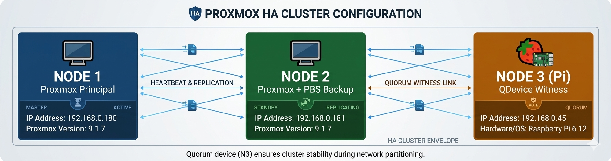
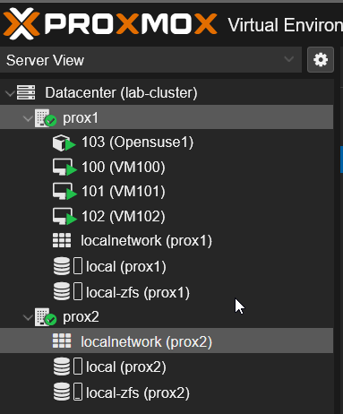
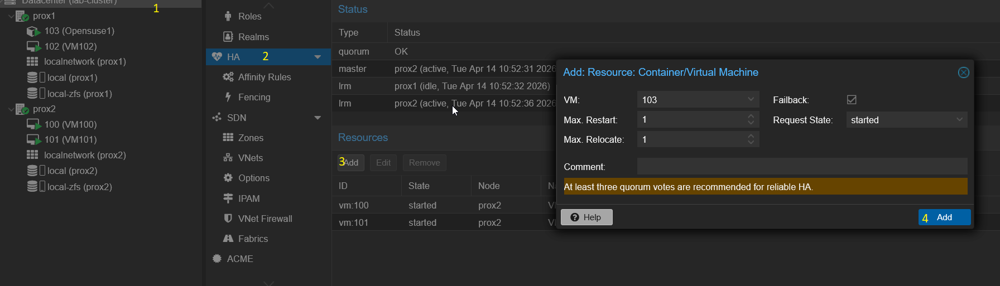
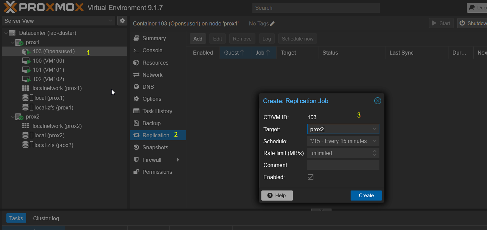
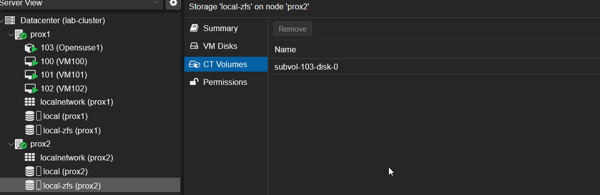
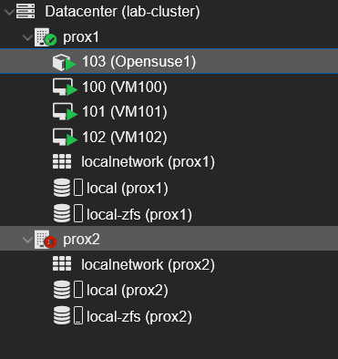

# 🖥️ Proxmox High Availability Cluster Lab (2 Nodes + QDevice)

## 📌 Project Goal

The objective of this project is to build a **High Availability Proxmox cluster** with:

* 2 Proxmox nodes (Primary / Secondary)
* ZFS-based storage replication
* Automatic failover of VMs and containers

💡 In case of failure of the primary node, the secondary node automatically takes over and restarts the virtual machines and containers.

---

## 🏗️ Architecture Overview

* **Node 1 (Primary)**: 192.168.0.180
* **Node 2 (Secondary)**: 192.168.0.181
* **QDevice (Raspberry Pi)**: 192.168.0.45

📸 Architecture diagram:


---

## ⚙️ Environment Setup

### Proxmox Installation

* Proxmox VE **9.1.7** installed on both nodes
* ZFS configured on each node

---

### ZFS Verification

#### Check ZFS Pool Status

```bash
zpool status
```

#### List ZFS Pools

```bash
zpool list
```

#### List ZFS Datasets

```bash
zfs list
```

---

## 🌐 Network Configuration

### Configure `/etc/hosts`

On **Node 1 and Node 2**:

```bash
nano /etc/hosts
```

Add:

```bash
192.168.0.180    pve1    pve1.homelab.local
192.168.0.181    pve2    pve2.homelab.local
```

---

## 🔗 Cluster Configuration

### Create Cluster (Node 1)

```bash
pvecm create lab-cluster
pvecm status
```

---

### Join Cluster (Node 2)

```bash
pvecm add 192.168.0.180
pvecm status
```

---

## 🧠 QDevice Configuration (Raspberry Pi)

### Prepare Raspberry Pi

```bash
apt update && apt full-upgrade -y
apt install corosync-qnetd -y
systemctl enable --now corosync-qnetd
```

---

### Install QDevice Client (Node 1 & Node 2)

```bash
apt install corosync-qdevice -y
```

---

### Configure SSH Access (Node 1)

```bash
ssh-keygen -t rsa -b 4096 -N '' -f ~/.ssh/id_rsa
ssh-copy-id root@192.168.0.45
```

---

### Add QDevice (Node 1)

```bash
pvecm qdevice setup 192.168.0.45
sleep 30
pvecm status
```

---

### Verify Cluster Status

```bash
pvecm status
corosync-quorumtool -l
```

📸 Cluster status (GUI):


---

## 🛡️ High Availability Configuration

📸 HA Configuration:


The HA system ensures that:

* If the primary node fails
* VMs and containers are automatically restarted on the secondary node

---

## 🔁 Replication Configuration

### Create VMs and Containers

* Deploy VMs and LXC containers on **Node 1**
* Use storage:

  * `local-zfs` for disks
  * `local` for ISO files

---

### Configure Replication

📸 Replication settings:


Check replication status:

```bash
pvesr status
```

📸 Replicated data on Node 2:


---

## 🧪 Testing & Validation

### Test 1: Node 2 Failure

📸 Node 2 down:


```bash
pvecm status
```

Result:

* Cluster remains operational
* Quorum maintained via QDevice

---

### Test 2: Node 1 Failure (Failover)

```bash
ha-manager status
```

Result:

* Services automatically migrate to Node 2
* VMs and containers restart on secondary node

---

## 🛠️ Troubleshooting

### Common Issue: ISO Blocking VM Restart

If a VM fails to restart on the secondary node:

👉 Cause:

* ISO file still mounted

### Solution:

```bash
ha-manager set vm:102 --state disabled
qm config 102
qm set 102 --delete ide2
ha-manager set vm:102 --state started
```

---

## 📊 Results

* ✅ Fully operational HA cluster
* ✅ Stable quorum with QDevice
* ✅ Automatic failover working
* ✅ ZFS replication validated
* ✅ VM and container migration successful

---

## 👤 Author

**Mamine Zaag**
DevOps / System Engineer

🚀 Focused on Infrastructure, Virtualization & Automation
